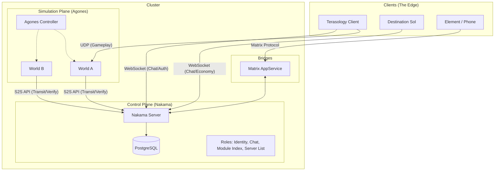
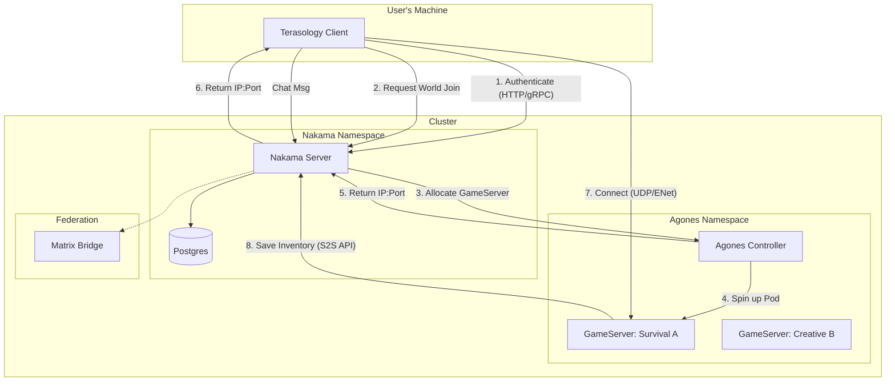

# Project Bifrost: Terasology Open Metaverse Architecture

Imported brainstorm from Gemini with plenty of inaccuracies but it touches on some interesting overarchitectural ideas.

## Overview

**Project Bifrost** is an architectural transformation of the **Terasology** ecosystem (and its satellite, **Destination Sol**) into a federated, interoperable OASIS-style Metaverse.

* **Identity & Meta:** Centralized but self-hosted via [Nakama](https://heroiclabs.com/nakama/).
  * More tooling ideally built with the spirit of https://omigroup.org/ to help bridge between games.
* **Simulation:** Ephemeral, containerized game servers managed by [Agones](https://agones.dev/). 
  * World data is backed up and restored when a server is needed again.
* **Data Model:** "World-Bound" character persistence (ARK-style) with similar server transfer capabilities.
  * Nakama helps here by temporarily holding serialized character data in its storage system if a player is trying to travel (world or game).
* **Interop:** Cross-game chat and economy linking Terasology (Multiplayer Voxel World) and Destination Sol (Single Player Space Arcade Shooter).
  * This is also powered by Nakama and chat Furthermore bridged to Matrix.

## High-Level Diagram

In this visualization the actual game server is what runs the world pods (and has the Nakama SDK enabled). The Nakama server handles some higher level systems.



## Example Flow

In theory transfer between worlds within a game is conceptually the same as transfer between servers (or even games). 



## 3. Core Technology Stack

| Component | Technology | Role | Design Choice |
| --- | --- | --- | --- |
| **Backend** | **Nakama** (Go) | Master Server | Handles Identity, Chat, RPCs, and "Cloud" Storage. |
| **Database** | **PostgreSQL** | Persistence | Standard SQL DB (Replacing CockroachDB recommendation). |
| **Orchestrator** | **Agones** (K8s) | Fleet Manager | Manages lifecycle of ephemeral Terasology Headless pods. |
| **Protocol** | **UDP / ENet** | Game Transport | Native Terasology networking. |
| **Protocol** | **WebSocket** | Meta Transport | Real-time chat & signals for Terasology & DestSol. |
| **Federation** | **Matrix** | Bridge | Exposes in-game chat to the open web. |

## 4. Data Model: "The Transit System"

We strictly avoid "Universal Avatar" complexity. Data lives in the **World** (ECS) by default and only enters **Nakama** during transit.

### 4.1. World-Bound Persistence (Default)

* **Player Data:** Stored in Terasology's standard Chunk/Entity store (Disk/S3) within the Pod.
* **Benefit:** Preserves complex ECS data (Mod components, block metadata) without serialization loss.
* **Behavior:** If a player logs off and back on to *Server A*, Nakama is only used for Auth. The world loads the character from disk.

### 4.2. The "Baton" Transfer (Zoning/Portals)

* **Scenario:** Player travels from World A (Pod A) to World B (Pod B).
* **Flow:**
1. **Trigger:** Collision with Portal.
2. **Upload:** Pod A serializes Player Entity to Nakama (`writeStorage`, TTL=5min).
3. **Handoff:** Pod A requests Pod B address from Nakama RPC.
4. **Reconnect:** Client disconnects A, connects B.
5. **Download:** Pod B fetches "Hot Data" from Nakama, spawns player, deletes data from Nakama.

### 4.3. The "Upload Terminal" (Server Travel)

* **Scenario:** Player wants to move character to a Friend's Server.
* **Mechanic:** ARK-style Obelisk.
* **Flow:** Player selects specific items to "Upload." These are removed from Local World and stored in Nakama (`persistent=true`). They can be downloaded on any other server that allows imports.

### 4.4. Interoperability (The "OASIS" Layer)

For some types of portable content you could transfer more than just a bit of textual descriptions.

* **Assets (OMI/glTF):**
  * Leverage Terasology's existing glTF support.
  * **Goal:** Allow runtime loading of assets based on Nakama metadata.
  * *Scenario:* User owns "Sword of OMI" (DB Item). Nakama sends URL to `.glb` file. Terasology downloads and renders it.


* **Chat (Matrix Bridge):**
  * Run a local AppService that listens to Nakama's "Global" chat channel.
  * Forward messages to a Matrix Room (e.g., `#terasology-public:matrix.org`).
  * Allows interaction with the game world from Element/mobile devices.
  * Allows chat bridging between distinct game worlds or even games

### 5.1. The "Hyperlink" Economy (Cross-Game)

**Destination Sol** connects as a "Satellite Client" via WebSocket. It shares no physics with Terasology, but shares **Information**.

* **The "Item Link" Protocol:**
* **Trigger:** Player in Terasology Shift-Clicks an item (e.g., "Diamond Pickaxe") in chat.
* **Payload:** Nakama broadcasts a structured JSON message.
* **Presentation:** DestSol Client sees a clickable text link: `[Diamond Pickaxe]`.


* **The "Materialize" Logic (Limited Transfer):**
* **Action:** DestSol player clicks the link -> Selects "Materialize."
* **Fallback Resolution:**
1. **Direct Match:** Does DestSol have an item ID `pickaxe`? -> No.
2. **Icon Match:** Does the JSON specify `icon: "pickaxe"`? -> Yes. Use generic "Space Tool" sprite.
3. **Generic Fallback:** Spawn a "Cargo Crate" item.


* **Result:** Player receives a "Cargo Crate" item named "Diamond Pickaxe".
* **Metadata:** The Crate contains the original description text ("A sturdy tool made of diamond") in its tooltip. It has *no* functional stats in space, serving as a trophy/collectible.


### 5.2. Legacy Meta Server Replacement

We replace the old custom web server with Nakama primitives:

| Legacy Feature | Nakama Implementation |
| --- | --- |
| **Module Index** | **Public Storage Object:** System writes JSON blob to `configuration/module_index`. Clients read it via `readStorage`. Support for ETags/Versioning. |
| **Server List** | **RPC Function:** `rpc.list_public_servers`. Queries the `servers` storage collection. Filters by heartbeat timestamp to remove zombies. |
| **Server Registration** | **Auth-Gated Write:** Any authenticated user can write to `servers` collection to advertise their game. |

### 5.3. External Federation

* **Matrix Bridge:** An AppService listens to the Nakama "Global" channel and forwards text to `#bifrost:matrix.org`.
* **OMI Standards:** Item JSON payloads follow [OMI-glTF](https://github.com/omigroup/gltf-extensions) loose standards where possible.


## 6. Implementation Roadmap

### Phase 1: The Foundation (Homelab)

* [ ] Deploy **PostgreSQL** & **Nakama** via Docker Compose.
* [ ] Configure Nakama with a "System" user for admin tasks.
* [ ] **Test:** Verify Terasology & DestSol can connect via simple Java SDK "Hello World."

### Phase 2: The Satellite (Destination Sol)

* [ ] Add `nakama-java-sdk` to Destination Sol.
* [ ] Implement "Metaverse HUD" (Chat overlay).
* [ ] Implement "Materialize" logic (JSON parsing -> Item Spawn).

### Phase 3: The Core (Terasology Client)

* [ ] Implement `Module:NakamaAuth` (Steam/Device Login).
* [ ] Replace Legacy Module Index fetcher with Nakama Storage reader.
* [ ] Implement Chat Bridge (NUI Chat -> Nakama Socket).

### Phase 4: The Fleet (Agones & Zoning)

* [ ] Deploy **Agones** to K8s.
* [ ] Containerize Terasology Headless.
* [ ] Implement the "Baton" logic (Serialize Entity -> Nakama -> Reconnect).


## Reference & Inspiration

While we are building a custom stack, we draw inspiration from:

* **V-Sekai:** For the spirit of using Godot/OSS engines for social virtual worlds / VR.
* **OMI (Open Metaverse Interoperability):** Specifically the [OMI-glTF extensions](https://github.com/omigroup/gltf-extensions) for defining physics/audio in asset files.
* **Third Room:** For the architecture of using Matrix as a data layer (even if we only use it for chat).

## Usage Example 

* **Nakama:** Handles Auth ("User 123 is valid"), Chat, and Server Discovery.
* **Terasology World:** Handles **everything else**. Your character, position, and inventory are serialized into the World Backup (the Chunk Store).

* **The Workflow:**
  * You log into "Server A."
  * Agones restores "Server A" from S3.
  * The game loads your character *exactly where you left it* from the world file.
  * Nakama is just verifying you are allowed to control that character.

* **Pros:** **Perfect Data Fidelity.** You never have to convert your complex ECS components into generic JSON. The "State" stays in the format the engine understands best (Java binaries/Protobuf).
* **Cons:** **The "Silo" Problem.** You cannot easily travel to "Server B" because your character is stuck inside the "Server A" save file.

### The Solution: The "Stargate" (Transit) Model

To get the best of both worlds (Persistent Worlds + Server Travel) implement the **ARK "Obelisk" / "Upload" mechanic** using Nakama.

#### How it works:

Only one example, may vary per game mode or base game.

1. **Standard Play:** Your character and items live 100% inside the Terasology World ECS and chunk store. No constant syncing to Nakama.
2. **The "Upload" Event:**
  * You walk to a portal/terminal in-game.
  * You explicitly choose to "Upload" your character or specific items to the "Cloud" (really any federated Nakama node in the system).
  * **Terasology** serializes *only* those specific entities and sends them to Nakama (`writeStorage`).
  * **Terasology** *deletes* those entities from the local world.
  * **Nakama** now holds your "Ghost" and/or items.
3. **The "Download" Event:**
  * You join a new server (Server B).
  * You spawn as a "fresh" character (or wake up in a clone bay).
  * You access a terminal and see your "Cloud Data" (via Nakama `readStorage`).
  * You click "Download."
  * **Terasology** injects the items into the local ECS and deletes them from Nakama.

### Why this fits Terasology better:

* **Simplifies the ECS:** You don't need to rewrite the `InventoryComponent` to be "Cloud-Native." It stays local. You only need to write a **Serializer** for the specific moment of transfer.
* **Risk Management:** If the server crashes during normal gameplay, you just roll back to the last local backup. You don't have desync issues where Nakama thinks you have an item but the World thinks you don't.
* **Gameplay Depth:** This allows for "World-Specific" progression (keeping the survival challenge intact) while still allowing you to "ascend" to a Metaverse tier to trade or travel.


## Reference Scenario: "First Contact" Demo

This scenario defines the requirements for the initial Proof of Concept video.

**Actors:**

1. **Alice** (Playing Terasology on PC).
2. **Bob** (Playing Destination Sol on Laptop).

**Sequence:**

1. **The Greeting:**
* Alice types in Terasology Global Chat: *"Greetings from the voxel world!"*
* Bob sees the message appear in his DestSol HUD (Orange text overlay).
* Bob replies: *"Read you loud and clear. Cruising the asteroid belt."*


2. **The Link:**
* Alice opens inventory, Shift-Clicks her **"Gelatinous Cube"** pet.
* Chat displays: *"Alice linked: [Gelatinous Cube]"*.


3. **The View:**
* Bob hovers over the `[Gelatinous Cube]` text in DestSol.
* A tooltip appears showing the description: *"A bouncy green slime friend."*


4. **The Transfer:**
* Bob clicks the link and selects **"Materialize"**.
* DestSol spawns a generic **"Stasis Pod"** item in Bob's cargo hold.
* The Stasis Pod is labeled *"Gelatinous Cube"* and uses a generic green icon (matched via Nakama metadata).


5. **The Result:**
* Bob jettisons the pod into space. It floats away as a physical object.

### Example JSON payload

```json
{
  "content": "Check out my pet!",
  "context": {
    "type": "item_link",
    "name": "Gelatinous Cube",
    "description": "A bouncy green slime friend.",
    "icon_hint": "slime_green", 
    "stats": { "rarity": "epic" }
  }
}