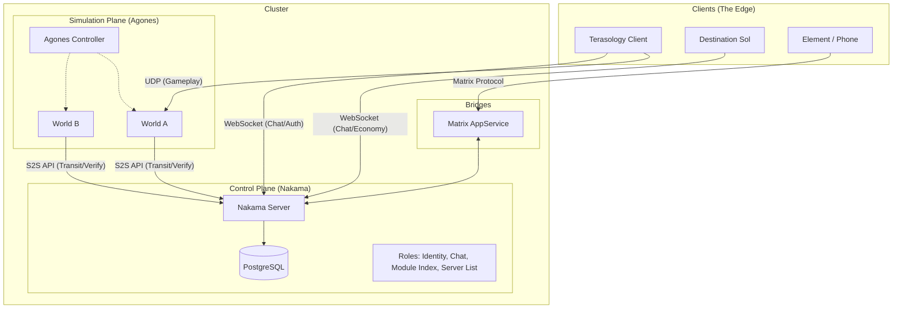
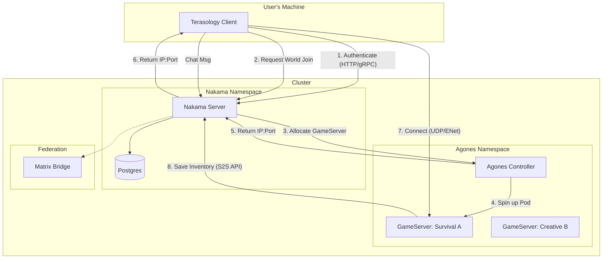

# Bifrost with Nakama and Agones

Brainstorming draft exploring Nakama as the coordination layer for a federated metaverse connecting Terasology and DestinationSol.

Nakama is an OSS game server with some additional proprietary tools. References here target only the OSS component (excluding the newer proprietary server UI — the OSS version ships with the older UI).

## Overview

This document explores an architectural transformation of the Terasology ecosystem (and DestinationSol) into a federated, interoperable metaverse using Nakama and Agones.

- **Identity and Meta**: Centralized but self-hosted via [Nakama](https://heroiclabs.com/nakama/). Additional tooling built in the spirit of [OMI Group](https://omigroup.org/) to help bridge between games.
- **Simulation**: Ephemeral, containerized game servers managed by [Agones](https://agones.dev/). World data is backed up and restored when a server is needed again.
- **Data Model**: "World-Bound" character persistence (ARK-style) with server transfer capabilities. Nakama temporarily holds serialized character data during travel.
- **Interop**: Cross-game chat and economy linking Terasology (multiplayer voxel world) and DestinationSol (single-player space shooter). Powered by Nakama, with chat additionally bridged to Matrix.

## High-Level Architecture

The actual game server runs the world pods (with Nakama SDK enabled). The Nakama server handles higher-level systems.



## Core Technology Stack

| Component | Technology | Role | Design Choice |
| --- | --- | --- | --- |
| Backend | Nakama (Go) | Master Server | Identity, Chat, RPCs, and "Cloud" Storage |
| Database | PostgreSQL | Persistence | Standard SQL DB (replacing CockroachDB recommendation) |
| Orchestrator | Agones (K8s) | Fleet Manager | Manages lifecycle of ephemeral Terasology Headless pods |
| Protocol | UDP / ENet | Game Transport | Native Terasology networking |
| Protocol | WebSocket | Meta Transport | Real-time chat and signals for Terasology and DestSol |
| Chat | Matrix | Bridge | Exposes in-game communication to the open web |

## Data Model: The Transit System

We strictly avoid "Universal Avatar" complexity. Data lives in the World (ECS) by default and only enters Nakama during transit.

### World-Bound Persistence

- Nakama handles auth ("User 123 is valid"), chat, and server discovery.
- Terasology World handles everything else. Character, position, and inventory are serialized into the World Backup (the Chunk Store).

Why this fits Terasology:

- **Data fidelity**: No need to convert complex ECS components into generic JSON. State stays in the format the engine understands (Java binaries/Protobuf).
- **Risk management**: If the server crashes, roll back to the last local backup. No desync between Nakama and the World.
- **ECS simplicity**: No need to rewrite `InventoryComponent` to be cloud-native. It stays local. You only need a serializer for the specific moment of transfer.

### The "Baton" Transfer (Zoning/Portals)

Scenario: Player travels from World A (Pod A) to World B (Pod B). The "Stargate" model.

1. Trigger: Collision with Portal in World A.
2. Upload: Pod A serializes Player Entity to Nakama (`writeStorage`, TTL=5min). Terasology deletes those entities from the local world. Nakama now holds the "Ghost" data.
3. Handoff: Pod A requests Pod B address from Nakama RPC.
4. Reconnect: Client disconnects from A, connects to B.
5. Download: Pod B fetches "Hot Data" from Nakama (`readStorage`), spawns player, and deletes data from Nakama.

### The "Upload Terminal" (Server Travel)

Scenario: Player wants to move character to a friend's server. ARK-style Obelisk / Upload Terminal.

- Player selects specific items to upload.
- Items are removed from the local world and stored in Nakama (`persistent=true`).
- They can be downloaded on any other server that allows imports.

## Interoperability (The "OASIS" Layer)

For some types of portable content, we can transfer more than just textual descriptions.

### Assets (OMI/glTF)

Leverage Terasology's existing glTF support for runtime loading of assets based on Nakama metadata. Example: user owns "Sword of Whimsy" which is known in the registry. Nakama sends URL to a `.glb` (binary glTF) file. Terasology downloads and renders it.

### Chat (Matrix Bridge)

A local Matrix AppService listens to Nakama's "Global" chat channel and forwards messages to a Matrix Room (e.g. `#terasology-public:matrix.org`). This allows interaction with the game world from Element/mobile devices/web.

### The "Hyperlink" Economy (Cross-Game)

DestinationSol connects as a "Satellite Client" via WebSocket. It shares no physics with Terasology, but shares information.

#### Item Link Protocol

Basic:

- Trigger: Player in Terasology shift-clicks an item (e.g. "Diamond Pickaxe") in chat.
- Payload: Nakama broadcasts a structured JSON message.
- Presentation: DestSol client sees a clickable text link: `[Diamond Pickaxe]`.

Advanced:

- Action: DestSol player clicks the link and selects "Materialize."
- Fallback resolution:
  1. Direct match: Does DestSol have an item ID `pickaxe`? No.
  2. Icon match: Does the JSON specify `icon: "pickaxe"`? Yes. Use generic "Space Tool" sprite.
  3. Generic fallback: Spawn a "Cargo Crate" item.
- Result: Player receives a "Cargo Crate" named "Diamond Pickaxe" with the original description as tooltip text. No functional stats in space — serves as a trophy/collectible.

## Reference Scenario: "First Contact" Demo

Requirements for the initial POC demonstrating the inter-game link. See also the dedicated First Contact design spec in the yggdrasil `docs/plans/` directory.

Actors:
1. Alice (playing Terasology)
2. Bob (playing DestinationSol)

Sequence:

1. **The Greeting**: Alice types in Terasology Global Chat: "Greetings from the voxel world!" Bob sees the message in his DestSol HUD. Bob replies: "Read you loud and clear. Cruising the asteroid belt."

2. **The Link** (stretch goal): Alice opens inventory, shift-clicks her "Gelatinous Cube" pet. Chat displays: "Alice linked: [Gelatinous Cube]".

3. **The View** (stretch goal): Bob hovers over the `[Gelatinous Cube]` text in DestSol. A tooltip shows the description: "A bouncy green slime friend."

4. **The Transfer** (stretch goal): Bob clicks the link and selects "Materialize." DestSol spawns a "Stasis Pod" item in Bob's cargo hold, labeled "Gelatinous Cube" with a generic green icon.

5. **The Result** (stretch goal): Bob jettisons the pod into space. It floats away as a physical object.

### Example JSON payload

```json
{
  "content": "Check out my pet!",
  "context": {
    "type": "item_link",
    "name": "Gelatinous Cube",
    "description": "A bouncy green slime friend.",
    "icon_hint": "slime_green",
    "stats": { "rarity": "epic" }
  }
}
```

## Legacy Meta Server Replacement

The old custom Terasology web server can be replaced with Nakama primitives:

| Legacy Feature | Nakama Implementation |
| --- | --- |
| Module Index | Public Storage Object: system writes JSON blob to `configuration/module_index`. Clients read via `readStorage`. |
| Server List | RPC Function: `rpc.list_public_servers`. Queries the `servers` storage collection. Filters by heartbeat timestamp. |
| Server Registration | Auth-Gated Write: any authenticated user can write to `servers` collection to advertise their game. |

## Implementation Roadmap

### Phase 1: The Foundation (Homelab)

- [ ] Deploy PostgreSQL and Nakama (Docker Compose or k8s manifests on Nordri)
- [ ] Configure Nakama with a "System" user for admin tasks
- [ ] Verify Terasology and DestSol can connect via simple Java SDK "Hello World"

### Phase 2: The Satellite (DestinationSol)

- [ ] Add nakama-java SDK to DestinationSol
- [ ] Implement chat overlay (banner-based for POC)
- [ ] Implement Materialize logic (JSON parsing to item spawn)

### Phase 3: The Core (Terasology Client)

- [ ] Implement NakamaSubSystem (device/Steam login)
- [ ] Replace legacy Module Index fetcher with Nakama Storage reader
- [ ] Implement chat bridge (Gestalt chat events to Nakama socket)

### Phase 4: The Fleet (Agones and Zoning)

- [ ] Deploy Agones to K8s (via Nordri/Tafl)
- [ ] Containerize Terasology Headless
- [ ] Implement the "Baton" logic (serialize entity to Nakama, reconnect, download)

## Reference and Inspiration

- **V-Sekai**: Spirit of using Godot/OSS engines for social virtual worlds and VR.
- **OMI (Open Metaverse Interoperability)**: Specifically the [OMI-glTF extensions](https://github.com/omigroup/gltf-extensions) for defining physics/audio in asset files.
- **Third Room**: Architecture of using Matrix as a data layer (even if we only use it for chat).

## World Transfer User Flow

Transfer between worlds within a game is conceptually the same as transfer between servers (or even games).



## Future Possibilities: Pixel Integration (Research Phase)

A potential later phase exploring visual continuity — solving the "Portal Problem" (seeing/moving between games) without requiring a unified game engine. The primary option is [Sunshine](https://github.com/LizardByte/Sunshine) (self-hosted game streaming) + [Moonlight](https://github.com/moonlight-stream/moonlight-qt) (stream client). [Wolf](https://github.com/games-on-whales/wolf) may be more appropriate for containerized streaming.

### Server Side: Headless Streaming

No desktop environment needed — just an X Server with a virtual display. Spin up ephemeral game servers that output video streams.

- Wolf (Games on Whales project) is a rewrite of the NVIDIA GameStream protocol for Docker/Kubernetes. It creates a container with a virtual GPU display socket.
- The pod starts an X server with no monitor (NVIDIA `ConnectedMonitor` driver option), launches the game process, and streams the output.
- Zero wasted RAM on desktop managers — just Kernel + Xorg + Game.

### Client Side: Headless Moonlight

Standard Moonlight expects to open a window on your monitor.

- **Transition Phase** (input/play): Standard Moonlight QT client launches as a borderless window over your current game. Works out of the box.
- **Portal Rendering** (texture feed): Moonlight Embedded or a custom implementation outputs to a framebuffer or pipe. Terasology reads from that pipe and paints it onto an in-game texture. Harder than NDI, but stays within the GameStream protocol.

### Scenario A: Cloud Play Transition

Player enters a portal to a game they don't have installed:

1. Player activates portal.
2. Agones spins up a Wolf Pod containing the target game.
3. Terasology launches a local Moonlight client (embedded window) connecting to the pod.
4. Player plays on the cloud instance while the local background downloader fetches assets.
5. Once local assets are ready, the cloud pod is terminated and the local engine takes over.

### Scenario B: Portal Surface (Remote View)

Seeing the "Other World" painted on a block surface:

1. The Wolf Pod renders the view from a "Camera Entity" in the remote world.
2. A headless Moonlight client receives the stream.
3. Terasology captures the frame buffer and applies it as a dynamic material to the portal block face.

Note: this requires a "Stream-to-Texture" adapter in Java (Terasology) that can decode the H.264 stream.

### Alternatives

#### NDI Protocol

Render a live view of DestinationSol (or another world) onto a surface inside Terasology using NDI (Network Device Interface) — standardized, low-latency video-over-IP. Java implementation via `devolay` (Java NDI bindings).

1. Sender: DestinationSol runs headless with an NDI Sender attached to its FrameBuffer.
2. Receiver: Terasology attaches an NDI Receiver to a portal block texture.
3. Result: Near-zero-latency video texture on the LAN.

A similar approach was attempted years ago to show a Terasology stream on a ComputerCraft monitor inside Minecraft during a MineCon panel, though that used local file manipulation rather than network streaming.

#### Engine Composition (Process Embedding)

Running two engines simultaneously without crashing the JVM.

Do NOT load two game engines (LWJGL + LibGDX) into the same JVM — they will conflict over the OpenGL context and static native libraries, causing SIGSEGV crashes.

Solution: OS-level window reparenting. Terasology acts as the "Hypervisor" (parent window), launches DestinationSol as a separate child process, finds its window handle, and embeds it into a Terasology UI canvas. This isolates memory and contexts completely while appearing seamless.

- Linux (X11): `XReparentWindow`
- Windows: `SetParent` (Win32 API)
