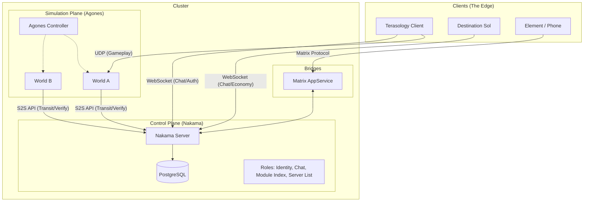

# Project Bifrost: Terasology Open Metaverse Architecture

Initial brainstorming draft exploring architectural ideas for a federated Metaverse.

## Overview

**Project Bifrost** is an architectural transformation of the **Terasology** ecosystem (and its satellite, **Destination Sol**) into a federated, interoperable OASIS-style Metaverse.

* **Identity & Meta:** Centralized but self-hosted via [Nakama](https://heroiclabs.com/nakama/).
  * More tooling ideally built with the spirit of https://omigroup.org/ to help bridge between games.
* **Simulation:** Ephemeral, containerized game servers managed by [Agones](https://agones.dev/).
  * World data is backed up and restored when a server is needed again.
* **Data Model:** "World-Bound" character persistence (ARK-style) with similar server transfer capabilities.
  * Nakama helps here by temporarily holding serialized character data in its storage system if a player is trying to travel (world or game).
* **Interop:** Cross-game chat and economy linking Terasology (Multiplayer Voxel World) and Destination Sol (Single Player Space Arcade Shooter).
  * This is also powered by Nakama and chat is additionally bridged to Matrix.

## High-Level Architecture

In this visualization, the actual game server is what runs the world pods (and has the Nakama SDK enabled). The Nakama server handles some higher level systems.



## Core Technology Stack

| Component | Technology | Role | Design Choice |
| --- | --- | --- | --- |
| **Backend** | **Nakama** (Go) | Master Server | Handles Identity, Chat, RPCs, and "Cloud" Storage. |
| **Database** | **PostgreSQL** | Persistence | Standard SQL DB (Replacing CockroachDB recommendation). |
| **Orchestrator** | **Agones** (K8s) | Fleet Manager | Manages lifecycle of ephemeral Terasology Headless pods. |
| **Protocol** | **UDP / ENet** | Game Transport | Native Terasology networking. |
| **Protocol** | **WebSocket** | Meta Transport | Real-time chat & signals for Terasology & DestSol. |
| **Federation** | **Matrix** | Bridge | Exposes in-game chat to the open web. |

## Data Model: "The Transit System"

We strictly avoid "Universal Avatar" complexity. Data lives in the **World** (ECS) by default and only enters **Nakama** during transit.

### Philosophy: World-Bound Persistence
* **Nakama:** Handles Auth ("User 123 is valid"), Chat, and Server Discovery.
* **Terasology World:** Handles **everything else**. Your character, position, and inventory are serialized into the World Backup (the Chunk Store).

**Why this fits Terasology:**
* **Perfect Data Fidelity:** You never have to convert your complex ECS components into generic JSON. The "State" stays in the format the engine understands best (Java binaries/Protobuf).
* **Risk Management:** If the server crashes during normal gameplay, you just roll back to the last local backup. You don't have desync issues where Nakama thinks you have an item but the World thinks you don't.
* **Simplifies the ECS:** You don't need to rewrite the `InventoryComponent` to be "Cloud-Native." It stays local. You only need to write a **Serializer** for the specific moment of transfer.

### The "Baton" Transfer (Zoning/Portals)

**Scenario:** Player travels from World A (Pod A) to World B (Pod B). This is the "Stargate" model.

**Flow:**
1. **Trigger:** Collision with Portal in World A.
2. **Upload:** Pod A serializes Player Entity to Nakama (`writeStorage`, TTL=5min).
   * *Terasology* deletes those entities from the local world.
   * *Nakama* now holds the "Ghost" data.
3. **Handoff:** Pod A requests Pod B address from Nakama RPC.
4. **Reconnect:** Client disconnects from A, connects to B.
5. **Download:** Pod B fetches "Hot Data" from Nakama (`readStorage`), spawns player, and deletes data from Nakama.

### The "Upload Terminal" (Server Travel)

**Scenario:** Player wants to move character to a Friend's Server.
**Mechanic:** ARK-style Obelisk / Upload Terminal.

**Flow:**
* Player selects specific items to "Upload."
* These are removed from the Local World and stored in Nakama (`persistent=true`).
* They can be downloaded on any other server that allows imports.

## Interoperability (The "OASIS" Layer)

For some types of portable content, we can transfer more than just textual descriptions.

### Assets (OMI/glTF)
* Leverage Terasology's existing glTF support.
* **Goal:** Allow runtime loading of assets based on Nakama metadata.
* **Scenario:** User owns "Sword of OMI" (DB Item). Nakama sends URL to `.glb` file. Terasology downloads and renders it.

### Chat (Matrix Bridge)
* Run a local AppService that listens to Nakama's "Global" chat channel.
* Forward messages to a Matrix Room (e.g., `#terasology-public:matrix.org`).
* **Benefit:** Allows interaction with the game world from Element/mobile devices and bridges distinct game worlds.

### The "Hyperlink" Economy (Cross-Game)

**Destination Sol** connects as a "Satellite Client" via WebSocket. It shares no physics with Terasology, but shares **Information**.

#### The "Item Link" Protocol
* **Trigger:** Player in Terasology Shift-Clicks an item (e.g., "Diamond Pickaxe") in chat.
* **Payload:** Nakama broadcasts a structured JSON message.
* **Presentation:** DestSol Client sees a clickable text link: `[Diamond Pickaxe]`.

#### The "Materialize" Logic (Limited Transfer)
* **Action:** DestSol player clicks the link -> Selects "Materialize."
* **Fallback Resolution:**
  1. **Direct Match:** Does DestSol have an item ID `pickaxe`? -> No.
  2. **Icon Match:** Does the JSON specify `icon: "pickaxe"`? -> Yes. Use generic "Space Tool" sprite.
  3. **Generic Fallback:** Spawn a "Cargo Crate" item.

* **Result:** Player receives a "Cargo Crate" item named "Diamond Pickaxe".
* **Metadata:** The Crate contains the original description text ("A sturdy tool made of diamond") in its tooltip. It has *no* functional stats in space, serving as a trophy/collectible.

## Reference Scenario: "First Contact" Demo

This scenario defines the requirements for the initial Proof of Concept video demonstrating the inter-game link.

**Actors:**
1. **Alice** (Playing Terasology on PC).
2. **Bob** (Playing Destination Sol on Laptop).

**Sequence:**

1. **The Greeting:**
   * Alice types in Terasology Global Chat: *"Greetings from the voxel world!"*
   * Bob sees the message appear in his DestSol HUD (Orange text overlay).
   * Bob replies: *"Read you loud and clear. Cruising the asteroid belt."*

2. **The Link:**
   * Alice opens inventory, Shift-Clicks her **"Gelatinous Cube"** pet.
   * Chat displays: *"Alice linked: [Gelatinous Cube]"*.

3. **The View:**
   * Bob hovers over the `[Gelatinous Cube]` text in DestSol.
   * A tooltip appears showing the description: *"A bouncy green slime friend."*

4. **The Transfer:**
   * Bob clicks the link and selects **"Materialize"**.
   * DestSol spawns a generic **"Stasis Pod"** item in Bob's cargo hold.
   * The Stasis Pod is labeled *"Gelatinous Cube"* and uses a generic green icon (matched via Nakama metadata).

5. **The Result:**
   * Bob jettisons the pod into space. It floats away as a physical object.

### Example JSON payload

```json
{
  "content": "Check out my pet!",
  "context": {
    "type": "item_link",
    "name": "Gelatinous Cube",
    "description": "A bouncy green slime friend.",
    "icon_hint": "slime_green", 
    "stats": { "rarity": "epic" }
  }
}
```

## Legacy Meta Server Replacement

We replace the old custom web server with Nakama primitives:

| Legacy Feature | Nakama Implementation |
| --- | --- |
| **Module Index** | **Public Storage Object:** System writes JSON blob to `configuration/module_index`. Clients read it via `readStorage`. Support for ETags/Versioning. |
| **Server List** | **RPC Function:** `rpc.list_public_servers`. Queries the `servers` storage collection. Filters by heartbeat timestamp to remove zombies. |
| **Server Registration** | **Auth-Gated Write:** Any authenticated user can write to `servers` collection to advertise their game. |

## Implementation Roadmap

### Phase 1: The Foundation (Homelab)
* [ ] Deploy **PostgreSQL** & **Nakama** via Docker Compose.
* [ ] Configure Nakama with a "System" user for admin tasks.
* [ ] **Test:** Verify Terasology & DestSol can connect via simple Java SDK "Hello World."

### Phase 2: The Satellite (Destination Sol)
* [ ] Add `nakama-java-sdk` to Destination Sol.
* [ ] Implement "Metaverse HUD" (Chat overlay).
* [ ] Implement "Materialize" logic (JSON parsing -> Item Spawn).

### Phase 3: The Core (Terasology Client)
* [ ] Implement `Module:NakamaAuth` (Steam/Device Login).
* [ ] Replace Legacy Module Index fetcher with Nakama Storage reader.
* [ ] Implement Chat Bridge (NUI Chat -> Nakama Socket).

### Phase 4: The Fleet (Agones & Zoning)
* [ ] Deploy **Agones** to K8s.
* [ ] Containerize Terasology Headless.
* [ ] Implement the "Baton" logic (Serialize Entity -> Nakama -> Reconnect).

## Reference & Inspiration

While we are building a custom stack, we draw inspiration from:

* **V-Sekai:** For the spirit of using Godot/OSS engines for social virtual worlds / VR.
* **OMI (Open Metaverse Interoperability):** Specifically the [OMI-glTF extensions](https://github.com/omigroup/gltf-extensions) for defining physics/audio in asset files.
* **Third Room:** For the architecture of using Matrix as a data layer (even if we only use it for chat).

## Another User Flow

In theory, transfer between worlds within a game is conceptually the same as transfer between servers (or even games).

```mermaid
graph TD
    subgraph Client [User's Machine]
        TC[Terasology Client]
    end

    subgraph Cluster
        direction TB
        
        subgraph Control_Plane [Nakama Namespace]
            NK[Nakama Server]
            DB[(Postgres)]
            NK --> DB
        end
        
        subgraph Game_Fleet [Agones Namespace]
            AG[Agones Controller]
            GS1[GameServer: Survival A]
            GS2[GameServer: Creative B]
        end
        
        subgraph Federation
            MX[Matrix Bridge]
        end
    end

    %% Auth Flow
    TC -- 1. Authenticate (HTTP/gRPC) --> NK
    
    %% Matchmaking Flow
    TC -- 2. Request World Join --> NK
    NK -- 3. Allocate GameServer --> AG
    AG -- 4. Spin up Pod --> GS1
    AG -- 5. Return IP:Port --> NK
    NK -- 6. Return IP:Port --> TC
    
    %% Gameplay Flow
    TC -- 7. Connect (UDP/ENet) --> GS1
    
    %% Persistence Flow (Async)
    GS1 -- 8. Save Inventory (S2S API) --> NK
    
    %% Chat Flow
    TC -- Chat Msg --> NK
    NK -.-> MX

## Future Possibilities: Pixel Integration (Research Phase)

A potential later phase that explores *Visual* continuity. These architectures aim to solve the "Portal Problem" (seeing/moving between games) without requiring a unified game engine.

### The Server Side: "Headless" Sunshine

Desktop environment not needed, just an **X Server** with a **Virtual Display**. Spin up ephemeral game servers that output video streams instead of just game state.

* **The Tool:** **Wolf** (from the *Games on Whales* project).
* **Why:** Wolf is a rewrite of the NVIDIA GameStream protocol specifically designed for Docker/Kubernetes. It doesn't just run Sunshine; it creates a container with a virtual GPU display socket.
* **The Pod:** It spins up, starts an X server with no monitor attached (using NVIDIA's `ConnectedMonitor` driver option), launches *only* your specific game process (e.g., Destination Sol), and streams the output.
* **Resource Usage:** Zero wasted RAM on desktop managers. It is just the Kernel + Xorg + Game.

### The Client Side: "Headless" Moonlight

This is the trickier part. Standard Moonlight expects to open a window on your monitor.

* **For "Transition Phase" (Input/Play):** You use the standard **Moonlight QT** client. It launches as a borderless window over your current game. This works out of the box.
* **For "Portal Rendering" (Texture Feed):** You need **Moonlight Embedded** or a custom implementation like **Moonlight-Libretro**.
* **The Trick:** You don't output to a screen. You output to a **Framebuffer** or **Pipe**.
* **Integration:** Your Terasology client reads from that pipe and paints it onto a texture in-game. (This is significantly harder than NDI, but keeps you within the GameStream protocol).

### Scenario A: The Transition Phase (Cloud Play)

**Use Case:** Player enters a portal to a game they don't have installed.

1. **Trigger:** Player activates Portal.
2. **Orchestration:** Agones spins up a **Wolf Pod** containing the target game.
3. **Connection:** Terasology launches a local **Moonlight Client** (embedded window) connecting to the Pod.
4. **Handoff:** Player plays on the cloud instance while the local background downloader fetches assets.
5. **Cutover:** Once local assets are ready, the Cloud Pod is terminated, and the local engine takes over.

### Scenario B: The Portal Surface (Remote View)

**Use Case:** Seeing the "Other World" painted on a block surface.

1. **Render:** The Wolf Pod renders the view from a "Camera Entity" in the remote world.
2. **Capture:** A modified Moonlight client (headless) receives the stream.
3. **Texture:** Terasology captures the Moonlight frame buffer and applies it as a **Dynamic Material** to the portal block face.
* *Note:* This requires writing a "Stream-to-Texture" adapter in Java (Terasology) that can decode the H.264 stream.

### Alternatives

#### Visual Portals (The "NDI" Protocol)

**Goal:** Render a live view of *Destination Sol* (or another world) onto a surface inside *Terasology*.

* **Technology:** **NDI (Network Device Interface)**.
* **Reasoning:** Standardized, open, low-latency video-over-IP widely used in broadcast.
* **Java Implementation:** Use the `devolay` (Java NDI bindings) library.

* **Architecture:**
1. **Sender:** Destination Sol runs in "Headless" mode but attaches an NDI Sender to its FrameBuffer instead of a physical monitor.
2. **Receiver:** Terasology attaches an NDI Receiver to a specific texture (e.g., a "Portal Block").
3. **Result:** Zero-latency video texture on the LAN. No complex RTSP/RTMP encoding overhead.

Something similar was already somewhat hackily attempted to show a Terasology stream on a ComputerCraft monitor inside Minecraft during a MineCon panel years ago.

#### Engine Composition (Process Embedding)

**Goal:** Running two engines "simultaneously" without crashing the JVM.

* **Constraint:** **Do NOT** attempt to load two Game Engines (LWJGL + LibGDX) into the same JVM. They will conflict over the OpenGL Context and static native libraries, causing immediate SIGSEGV crashes.
* **Solution:** **OS-Level Window Reparenting**.
* **Linux (X11):** Use `XReparentWindow`.
* **Windows:** Use `SetParent` (Win32 API).

* **Design:** Terasology acts as the "Hypervisor" (Parent Window). It launches Destination Sol as a separate child process, finds its window handle, and forcibly embeds it into a Terasology UI Canvas. This isolates the memory and contexts completely while appearing seamless to the user.
