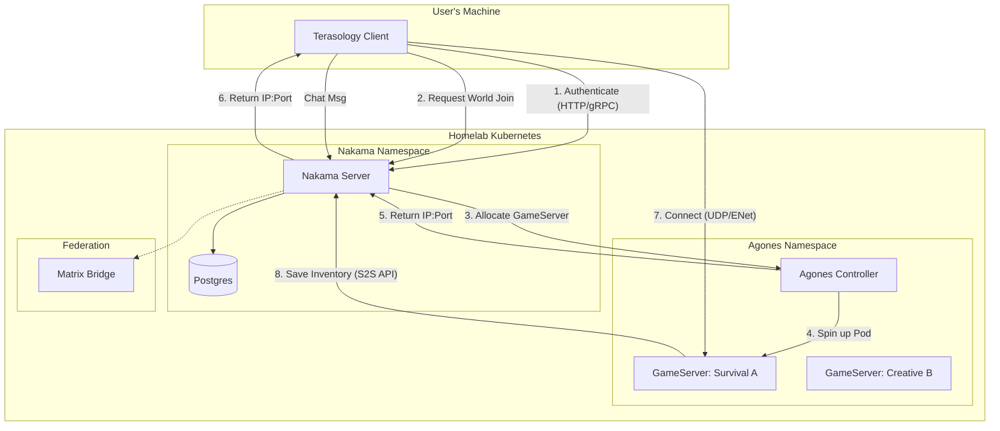

# Project Bifrost: Terasology Open Metaverse Architecture

Imported brainstorm from Gemini with plenty of inaccuracies but it touches on some interesting overarchitectural ideas.

## 1. Executive Summary

This document outlines the architectural transformation of **Terasology** from a standalone engine into a federated, "OASIS-style" Metaverse client.

The goal is to decouple **Simulation** (Physics/Voxels) from **State** (Identity/Inventory) using a modern, open-source stack. This avoids the insecure "Trusted Client" model (Valheim) and the clunky "File Share" model (ARK) by using a **Transactional Database** model (Nakama) orchestrated by Kubernetes (Agones).

## 2. High-Level Architecture

The system is composed of three distinct planes:

1. **The Persistence Plane (Nakama):** The "Source of Truth" for player data.
2. **The Simulation Plane (Agones + Terasology):** Ephemeral, disposable game worlds.
3. **The Interop Plane (OMI/Matrix):** Standards for connecting to the wider ecosystem.

### Architecture Diagram



## 3. Core Technology Stack

| Component | Technology | Role | Justification |
| --- | --- | --- | --- |
| **Client** | **Terasology** (Java) | Visualization & Input | Existing mature voxel engine. Open source (Apache 2.0). |
| **Backend** | **Nakama** (Go) | Identity, Chat, Storage | Handles "Hard" MMO features out of the box. Runs locally in Docker. |
| **Database** | **PostgreSQL** | Persistence | Industry standard. Reliable ACID compliance for inventory. |
| **Orchestrator** | **Agones** (K8s) | Server Lifecycle | Native K8s integration. Manages the "GameServer" CRD fleet. |
| **Protocol** | **UDP / ENet** | Gameplay Transport | Low latency state sync (already in Terasology). |
| **Federation** | **Matrix** | Chat / Signaling | Decentralized, persistent communication layer. |

## 4. Component Design

### 4.1. Identity & Authentication (The "Passport")

* **Current State:** Terasology uses local identity files or simple auth.
* **New Design:**
  * Implement `Module:NakamaAuth` in Terasology.
  * On launch, Client authenticates via `POST /v2/account/authenticate/device` (or Steam/Email).
  * Nakama returns a **JWT Session Token**.
  * Client passes this Token to the Game Server upon UDP connection.
  * Game Server validates Token with Nakama S2S (Server-to-Server) API.


### 4.2. Persistent Storage (The "Wallet")

* **Philosophy:** "The World is Ephemeral, The Player is Permanent."
* **Data Structure (Nakama Storage Objects):**
```json
// Collection: "Economy", Key: "Wallet"
{
  "coins": 500,
  "cosmetics": ["hat_viking_01", "cape_devops"],
  "inventory_slots": [...]
}

```


* **Workflow:**
  * **Join:** Game Server calls `readStorageObjects(userId)`.
  * **Play:** Game Server maintains authoritative state in memory (ECS).
  * **Leave/Save:** Game Server serializes ECS components -> JSON -> `writeStorageObjects()`.


### 4.3. World Management (The "Arena")

* **Agones Integration:**
  * Define a `GameServer` fleet in Kubernetes YAML.
  * Use Terasology's "Headless" mode (`gradlew run -Pheadless`).
  * **Scaling:** Configure Agones to maintain a "Warm Pool" of 2 servers ready to accept players instantly.


### 4.4. Interoperability (The "OASIS" Layer)

* **Assets (OMI/glTF):**
  * Leverage Terasology's existing glTF support.
  * **Goal:** Allow runtime loading of assets based on Nakama metadata.
  * *Scenario:* User owns "Sword of OMI" (DB Item). Nakama sends URL to `.glb` file. Terasology downloads and renders it.


* **Chat (Matrix Bridge):**
  * Run a local AppService that listens to Nakama's "Global" chat channel.
  * Forward messages to a Matrix Room (e.g., `#terasology-public:matrix.org`).
  * Allows interaction with the game world from Element/mobile devices.
  * Allows chat bridging between distinct game worlds or even games


## 5. Implementation Roadmap

### Phase 1: Local Loop (The "Hello World")

* [ ] Spin up Nakama + Postgres via Docker Compose.
* [ ] Create a basic Terasology Module (`NakamaCore`) that includes the Nakama Java SDK.
* [ ] Implement a UI screen in Terasology to login and display "Welcome, [Username]" from Nakama.
* [ ] **Milestone:** Terasology client successfully talking to a local Nakama container.

### Phase 2: The Headless Handshake

* [ ] Modify Terasology Headless server to accept a "Server Key".
* [ ] Implement the S2S (Server-to-Server) call to verify a user's token on join.
* [ ] **Milestone:** A player cannot join the local server without a valid Nakama session.

### Phase 3: The Inventory Link

* [ ] Map Terasology's `InventoryComponent` to a simple JSON schema.
* [ ] Implement Load/Save logic hooks in the Game Server.
* [ ] **Milestone:** Log in, get a dirt block, log out. Delete local world data. Log in again -> Dirt block is restored from Nakama.

### Phase 4: Cluster Deployment (The "SRE" Work)

* [ ] Deploy Agones to the West Orange Homelab cluster.
* [ ] Containerize Terasology Headless (Dockerfile).
* [ ] Create `fleet.yaml` for Terasology.
* [ ] **Milestone:** "Press Play" spawns a pod in Kubernetes.


## 6. Reference & Inspiration

While we are building a custom stack, we draw inspiration from:

* **V-Sekai:** For the spirit of using Godot/OSS engines for social VR.
* **OMI (Open Metaverse Interoperability):** Specifically the [OMI-glTF extensions](https://github.com/omigroup/gltf-extensions) for defining physics/audio in asset files.
* **Third Room:** For the architecture of using Matrix as a data layer (even if we only use it for chat).


## Addendum: clarifications

### 1. The "Universal Avatar" (Valheim-Secure Model)

*This was the assumption in the initial Design Doc (above).*

* **Concept:** Your inventory lives in Nakama. When you join *any* server, your items are injected into the ECS.
* **Pros:** True "Ready Player One" feel. You are the same entity everywhere.
* **Cons:** **Data Fidelity Loss.** Terasology’s ECS is complex (block data, nested items, durability, custom component data). Flattening that rich Java object structure into a JSON blob for Nakama every time you save is difficult. You risk losing "mod-specific" data if Nakama doesn't know how to store it.

### 2. The "World-Bound" (ARK Model)

*This is what you are suggesting.*

* **Concept:**
  * **Nakama:** Handles Auth ("User 123 is valid"), Chat, and Server Discovery.
  * **Terasology World:** Handles **everything else**. Your character, position, and inventory are serialized into the World Backup (the Chunk Store).


* **The Workflow:**
  * You log into "Server A."
  * Agones restores "Server A" from S3.
  * The game loads your character *exactly where you left it* from the world file.
  * Nakama is just verifying you are allowed to control that character.

* **Pros:** **Perfect Data Fidelity.** You never have to convert your complex ECS components into generic JSON. The "State" stays in the format the engine understands best (Java binaries/Protobuf).
* **Cons:** **The "Silo" Problem.** You cannot easily travel to "Server B" because your character is stuck inside the "Server A" save file.

### 3. The Solution: The "Stargate" (Transit) Model

To get the best of both worlds (Persistent Worlds + Server Travel) without rewriting the entire Terasology inventory system, you can implement the **ARK "Obelisk" / "Upload" mechanic** using Nakama.

In this model, **Nakama is not your Backpack; Nakama is your Luggage Belt.**

#### How it works:

1. **Standard Play:** Your character and items live 100% inside the Terasology World ECS. No constant syncing to Nakama.
2. **The "Upload" Event:**
  * You walk to a portal/terminal in-game.
  * You explicitly choose to "Upload" your character or specific items to the Cloud.
  * **Terasology** serializes *only* those specific entities and sends them to Nakama (`writeStorage`).
  * **Terasology** *deletes* those entities from the local world.
  * **Nakama** now holds your "Ghost."
3. **The "Download" Event:**
  * You join a new server (Server B).
  * You spawn as a "fresh" character (or wake up in a clone bay).
  * You access a terminal and see your "Cloud Data" (via Nakama `readStorage`).
  * You click "Download."
  * **Terasology** injects the items into the local ECS and deletes them from Nakama.

### Why this fits Terasology better:

* **Simplifies the ECS:** You don't need to rewrite the `InventoryComponent` to be "Cloud-Native." It stays local. You only need to write a **Serializer** for the specific moment of transfer.
* **Risk Management:** If the server crashes during normal gameplay, you just roll back to the last local backup. You don't have desync issues where Nakama thinks you have an item but the World thinks you don't.
* **Gameplay Depth:** This allows for "World-Specific" progression (keeping the survival challenge intact) while still allowing you to "ascend" to a Metaverse tier to trade or travel.

### Revised Design Doc Section

If you prefer this approach, here is how the **Component Design** section changes:

#### 4.2. Persistent Storage (The "Transit" Model)

* **Philosophy:** "Data lives in the World; Nakama is the Ferry."
* **Player Data:** Stored in Terasology's native Chunk/Entity store (on-disk/S3).
* **Nakama's Role:**
  * **Auth:** Verifies user identity on login.
  * **Transit Buffer:** Temporary storage for Entity Data (JSON) during server transfers.
  * **Global Meta:** Stores high-level account stats (Achievement unlocks, Global Chat history) that are independent of physics/items.
